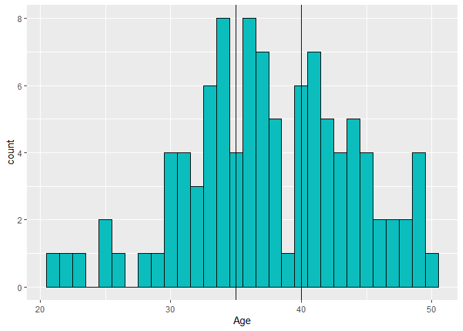
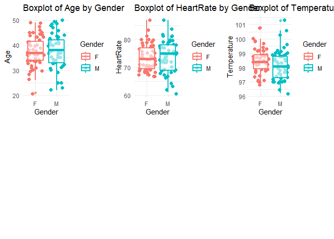
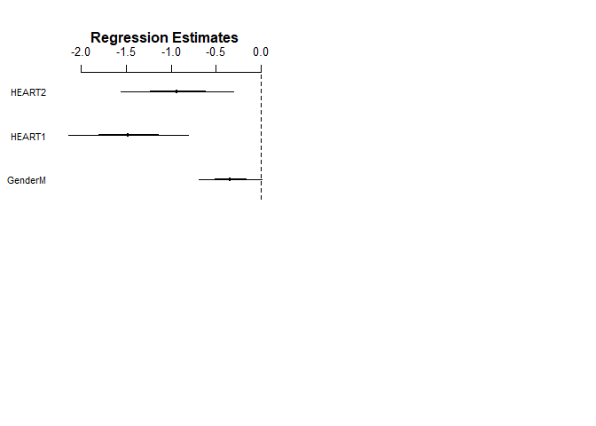

Analyses with Data from Biostatistics With R
================
Paul G. Smith
First created on Nov 1, 2019. Updated on Nov 03, 2019

## Analyses with Data from Biostatistics With R by Babak Shahbaba

### Analysis of BodyTemperature Data Set

``` r
source("BodyTemperature.R", echo = TRUE)
```

    ## 
    ## > library(scales)
    ## 
    ## > library(Hmisc)

    ## Loading required package: lattice

    ## Loading required package: survival

    ## Loading required package: Formula

    ## Loading required package: ggplot2

    ## 
    ## Attaching package: 'Hmisc'

    ## The following objects are masked from 'package:base':
    ## 
    ##     format.pval, units

    ## 
    ## > library(e1071)

    ## 
    ## Attaching package: 'e1071'

    ## The following object is masked from 'package:Hmisc':
    ## 
    ##     impute

    ## 
    ## > library(psych)

    ## 
    ## Attaching package: 'psych'

    ## The following object is masked from 'package:Hmisc':
    ## 
    ##     describe

    ## The following objects are masked from 'package:ggplot2':
    ## 
    ##     %+%, alpha

    ## The following objects are masked from 'package:scales':
    ## 
    ##     alpha, rescale

    ## 
    ## > library(ggplot2)
    ## 
    ## > library(gridExtra)
    ## 
    ## > library(arm)

    ## Loading required package: MASS

    ## Loading required package: Matrix

    ## Loading required package: lme4

    ## 
    ## arm (Version 1.10-1, built: 2018-4-12)

    ## Working directory is D:/RProjects/github/biostatistics

    ## 
    ## Attaching package: 'arm'

    ## The following objects are masked from 'package:psych':
    ## 
    ##     logit, rescale, sim

    ## The following object is masked from 'package:scales':
    ## 
    ##     rescale

    ## 
    ## > library(gvlma)
    ## 
    ## > BodyTemperature <- read.csv("./data/BodyTemperature.txt", 
    ## +     header = TRUE, sep = " ")
    ## 
    ## > summary(BodyTemperature$Age)
    ##    Min. 1st Qu.  Median    Mean 3rd Qu.    Max. 
    ##   21.00   33.75   37.00   37.62   42.00   50.00 
    ## 
    ## > BodyTemperature$AGEGRP <- 9
    ## 
    ## > BodyTemperature$AGEGRP[BodyTemperature$Age < 25] <- 1
    ## 
    ## > BodyTemperature$AGEGRP[BodyTemperature$Age > 24 & 
    ## +     BodyTemperature$Age < 35] <- 2
    ## 
    ## > BodyTemperature$AGEGRP[BodyTemperature$Age > 34 & 
    ## +     BodyTemperature$Age < 45] <- 3
    ## 
    ## > BodyTemperature$AGEGRP[BodyTemperature$Age > 44] <- 4
    ## 
    ## > table(BodyTemperature$AGEGRP)
    ## 
    ##  1  2  3  4 
    ##  3 30 52 15 
    ## 
    ## > BodyTemperature$AGEGRP <- as.factor(BodyTemperature$AGEGRP)
    ## 
    ## > BodyTemperature$AGE1 <- 0
    ## 
    ## > BodyTemperature$AGE2 <- 0
    ## 
    ## > BodyTemperature$AGE3 <- 0
    ## 
    ## > BodyTemperature$AGE4 <- 0
    ## 
    ## > BodyTemperature$AGE1[BodyTemperature$Age < 25] <- 1
    ## 
    ## > BodyTemperature$AGE2[BodyTemperature$Age > 24 & BodyTemperature$Age < 
    ## +     35] <- 1
    ## 
    ## > BodyTemperature$AGE3[BodyTemperature$Age > 34 & BodyTemperature$Age < 
    ## +     45] <- 1
    ## 
    ## > BodyTemperature$AGE4[BodyTemperature$Age > 44 & BodyTemperature$Age < 
    ## +     55] <- 1
    ## 
    ## > table(BodyTemperature$AGEGRP, BodyTemperature$AGE1)
    ##    
    ##      0  1
    ##   1  0  3
    ##   2 30  0
    ##   3 52  0
    ##   4 15  0
    ## 
    ## > table(BodyTemperature$AGEGRP, BodyTemperature$AGE2)
    ##    
    ##      0  1
    ##   1  3  0
    ##   2  0 30
    ##   3 52  0
    ##   4 15  0
    ## 
    ## > table(BodyTemperature$AGEGRP, BodyTemperature$AGE3)
    ##    
    ##      0  1
    ##   1  3  0
    ##   2 30  0
    ##   3  0 52
    ##   4 15  0
    ## 
    ## > table(BodyTemperature$AGEGRP, BodyTemperature$AGE4)
    ##    
    ##      0  1
    ##   1  3  0
    ##   2 30  0
    ##   3 52  0
    ##   4  0 15
    ## 
    ## > str(BodyTemperature)
    ## 'data.frame':    100 obs. of  9 variables:
    ##  $ Gender     : Factor w/ 2 levels "F","M": 2 2 2 1 1 2 1 1 1 2 ...
    ##  $ Age        : int  33 32 42 33 26 37 32 45 31 49 ...
    ##  $ HeartRate  : int  69 72 68 75 68 79 71 73 77 81 ...
    ##  $ Temperature: num  97 98.8 96.2 97.8 98.8 ...
    ##  $ AGEGRP     : Factor w/ 4 levels "1","2","3","4": 2 2 3 2 2 3 2 4 2 4 ...
    ##  $ AGE1       : num  0 0 0 0 0 0 0 0 0 0 ...
    ##  $ AGE2       : num  1 1 0 1 1 0 1 0 1 0 ...
    ##  $ AGE3       : num  0 0 1 0 0 1 0 0 0 0 ...
    ##  $ AGE4       : num  0 0 0 0 0 0 0 1 0 1 ...
    ## 
    ## > summary(BodyTemperature)
    ##  Gender      Age          HeartRate      Temperature     AGEGRP
    ##  F:51   Min.   :21.00   Min.   :61.00   Min.   : 96.20   1: 3  
    ##  M:49   1st Qu.:33.75   1st Qu.:69.00   1st Qu.: 97.70   2:30  
    ##         Median :37.00   Median :73.00   Median : 98.30   3:52  
    ##         Mean   :37.62   Mean   :73.66   Mean   : 98.33   4:15  
    ##         3rd Qu.:42.00   3rd Qu.:78.00   3rd Qu.: 98.90         
    ##         Max.   :50.00   Max.   :87.00   Max.   :101.30         
    ##       AGE1           AGE2          AGE3           AGE4     
    ##  Min.   :0.00   Min.   :0.0   Min.   :0.00   Min.   :0.00  
    ##  1st Qu.:0.00   1st Qu.:0.0   1st Qu.:0.00   1st Qu.:0.00  
    ##  Median :0.00   Median :0.0   Median :1.00   Median :0.00  
    ##  Mean   :0.03   Mean   :0.3   Mean   :0.52   Mean   :0.15  
    ##  3rd Qu.:0.00   3rd Qu.:1.0   3rd Qu.:1.00   3rd Qu.:0.00  
    ##  Max.   :1.00   Max.   :1.0   Max.   :1.00   Max.   :1.00  
    ## 
    ## > sapply(BodyTemperature[2:4], function(x) c(`Stand dev` = sd(x), 
    ## +     Mean = mean(x, na.rm = TRUE), n = length(x), Median = median(x), 
    ## +     Coeff .... [TRUNCATED] 
    ##                             Age    HeartRate  Temperature
    ## Stand dev             6.4303259   5.31287744 9.568995e-01
    ## Mean                 37.6200000  73.66000000 9.833000e+01
    ## n                   100.0000000 100.00000000 1.000000e+02
    ## Median               37.0000000  73.00000000 9.830000e+01
    ## CoeffofVariation      0.1709284   0.07212704 9.731511e-03
    ## Minimum              21.0000000  61.00000000 9.620000e+01
    ## Maximun              50.0000000  87.00000000 1.013000e+02
    ## Upper Quantile.100%  50.0000000  87.00000000 1.013000e+02
    ## LowerQuartile.0%     21.0000000  61.00000000 9.620000e+01
    ## 
    ## > data_dictionary <- Hmisc::describe((BodyTemperature))
    ## 
    ## > sink("./data/BodyTemperature_data_dictionary.txt", 
    ## +     append = TRUE)
    ## 
    ## > psych::describe(BodyTemperature)
    ##             vars   n  mean   sd median trimmed  mad  min   max range  skew
    ## Gender*        1 100  1.49 0.50    1.0    1.49 0.00  1.0   2.0   1.0  0.04
    ## Age            2 100 37.62 6.43   37.0   37.76 5.93 21.0  50.0  29.0 -0.23
    ## HeartRate      3 100 73.66 5.31   73.0   73.60 5.93 61.0  87.0  26.0  0.09
    ## Temperature    4 100 98.33 0.96   98.3   98.29 0.89 96.2 101.3   5.1  0.38
    ## AGEGRP*        5 100  2.79 0.73    3.0    2.77 0.00  1.0   4.0   3.0 -0.13
    ## AGE1           6 100  0.03 0.17    0.0    0.00 0.00  0.0   1.0   1.0  5.43
    ## AGE2           7 100  0.30 0.46    0.0    0.25 0.00  0.0   1.0   1.0  0.86
    ## AGE3           8 100  0.52 0.50    1.0    0.52 0.00  0.0   1.0   1.0 -0.08
    ## AGE4           9 100  0.15 0.36    0.0    0.06 0.00  0.0   1.0   1.0  1.93
    ##             kurtosis   se
    ## Gender*        -2.02 0.05
    ## Age            -0.32 0.64
    ## HeartRate      -0.38 0.53
    ## Temperature     0.22 0.10
    ## AGEGRP*        -0.35 0.07
    ## AGE1           27.74 0.02
    ## AGE2           -1.27 0.05
    ## AGE3           -2.01 0.05
    ## AGE4            1.75 0.04
    ## 
    ## > p1 <- ggplot(BodyTemperature, aes(Gender))
    ## 
    ## > p1 <- p1 + geom_bar(fill = "steelblue", color = "steelblue") + 
    ## +     theme_minimal() + labs(title = "Bar Chart of Gender")
    ## 
    ## > p2 <- ggplot(BodyTemperature, aes(Age))
    ## 
    ## > p2 <- p2 + geom_histogram(aes(color = Age), color = "darkblue", 
    ## +     fill = "steelblue") + theme_minimal() + labs(title = "Histogram of Age")
    ## 
    ## > p3 <- ggplot(BodyTemperature, aes(HeartRate))
    ## 
    ## > p3 + geom_histogram(aes(color = HeartRate), color = "darkblue", 
    ## +     fill = "steelblue") + theme_minimal() + labs(title = "Histogram of HeartRate" .... [TRUNCATED]

    ## `stat_bin()` using `bins = 30`. Pick better value with `binwidth`.

<!-- -->

    ## 
    ## > p4 <- ggplot(BodyTemperature, aes(Temperature))
    ## 
    ## > p4 <- p4 + geom_histogram(aes(color = Temperature), 
    ## +     color = "darkblue", fill = "steelblue") + theme_minimal() + 
    ## +     labs(title = "Histogra ..." ... [TRUNCATED] 
    ## 
    ## > grid.arrange(p1, p2, p3, p4, nrow = 2, ncol = 2)

    ## `stat_bin()` using `bins = 30`. Pick better value with `binwidth`.

    ## `stat_bin()` using `bins = 30`. Pick better value with `binwidth`.

<!-- -->

    ## 
    ## > pretty_breaks(3)(BodyTemperature$HeartRate)
    ## [1] 60 70 80 90
    ## 
    ## > p3 <- ggplot(BodyTemperature, aes(HeartRate))
    ## 
    ## > p3 + geom_histogram(aes(color = HeartRate), color = "darkblue", 
    ## +     fill = "steelblue") + geom_vline(xintercept = 70) + geom_vline(xintercept = 8 .... [TRUNCATED]

    ## `stat_bin()` using `bins = 30`. Pick better value with `binwidth`.

<!-- -->

    ## 
    ## > BodyTemperature$HEARTRATEGRP <- 9
    ## 
    ## > BodyTemperature$HEARTRATEGRP[BodyTemperature$HeartRate < 
    ## +     71] <- 1
    ## 
    ## > BodyTemperature$HEARTRATEGRP[BodyTemperature$HeartRate > 
    ## +     70 & BodyTemperature$HeartRate < 81] <- 2
    ## 
    ## > BodyTemperature$HEARTRATEGRP[BodyTemperature$HeartRate > 
    ## +     80] <- 3
    ## 
    ## > table(BodyTemperature$HEARTRATEGRP)
    ## 
    ##  1  2  3 
    ## 31 60  9 
    ## 
    ## > BodyTemperature$HEARTRATEGRP <- as.factor(BodyTemperature$HEARTRATEGRP)
    ## 
    ## > BodyTemperature$HEART1 <- 0
    ## 
    ## > BodyTemperature$HEART2 <- 0
    ## 
    ## > BodyTemperature$HEART3 <- 0
    ## 
    ## > BodyTemperature$HEART1[BodyTemperature$HEARTRATEGRP == 
    ## +     1] <- 1
    ## 
    ## > BodyTemperature$HEART2[BodyTemperature$HEARTRATEGRP == 
    ## +     2] <- 1
    ## 
    ## > BodyTemperature$HEART3[BodyTemperature$HEARTRATEGRP == 
    ## +     3] <- 1
    ## 
    ## > table(BodyTemperature$HEARTRATEGRP, BodyTemperature$HEART1)
    ##    
    ##      0  1
    ##   1  0 31
    ##   2 60  0
    ##   3  9  0
    ## 
    ## > table(BodyTemperature$HEARTRATEGRP, BodyTemperature$HEART2)
    ##    
    ##      0  1
    ##   1 31  0
    ##   2  0 60
    ##   3  9  0
    ## 
    ## > table(BodyTemperature$HEARTRATEGRP, BodyTemperature$HEART3)
    ##    
    ##      0  1
    ##   1 31  0
    ##   2 60  0
    ##   3  0  9
    ## 
    ## > p5 <- ggplot(BodyTemperature, aes(x = Gender, y = Age))
    ## 
    ## > p5 <- p5 + geom_jitter(aes(color = Gender), size = 2) + 
    ## +     geom_boxplot(aes(color = Gender), alpha = 0.6, size = 1) + 
    ## +     theme_minimal() + l .... [TRUNCATED] 
    ## 
    ## > p6 <- ggplot(BodyTemperature, aes(x = Gender, y = HeartRate))
    ## 
    ## > p6 <- p6 + geom_jitter(aes(color = Gender), size = 2) + 
    ## +     geom_boxplot(aes(color = Gender), alpha = 0.6, size = 1) + 
    ## +     theme_minimal() + l .... [TRUNCATED] 
    ## 
    ## > p7 <- ggplot(BodyTemperature, aes(x = Gender, y = Temperature))
    ## 
    ## > p7 <- p7 + geom_jitter(aes(color = Gender), size = 2) + 
    ## +     geom_boxplot(aes(color = Gender), alpha = 0.6, size = 1) + 
    ## +     theme_minimal() + l .... [TRUNCATED] 
    ## 
    ## > grid.arrange(p5, p6, p7, nrow = 2, ncol = 3)

<!-- -->

    ## 
    ## > p8 <- ggplot(BodyTemperature, aes(x = Age, y = HeartRate, 
    ## +     color = Gender))
    ## 
    ## > p8 <- p8 + geom_point(size = 2) + geom_smooth()
    ## 
    ## > p9 <- ggplot(BodyTemperature, aes(x = Age, y = Temperature, 
    ## +     color = Gender))
    ## 
    ## > p9 <- p9 + geom_point(size = 2) + geom_smooth()
    ## 
    ## > p10 <- ggplot(BodyTemperature, aes(x = HeartRate, 
    ## +     y = Temperature, color = Gender))
    ## 
    ## > p10 <- p10 + geom_point(size = 2) + geom_smooth()
    ## 
    ## > grid.arrange(p8, p9, p10, nrow = 2, ncol = 2)

    ## `geom_smooth()` using method = 'loess' and formula 'y ~ x'

    ## `geom_smooth()` using method = 'loess' and formula 'y ~ x'
    ## `geom_smooth()` using method = 'loess' and formula 'y ~ x'

<!-- -->

    ## 
    ## > model1 <- lm(Temperature ~ Gender + Age + HeartRate, 
    ## +     data = BodyTemperature)
    ## 
    ## > summary(model1)
    ## 
    ## Call:
    ## lm(formula = Temperature ~ Gender + Age + HeartRate, data = BodyTemperature)
    ## 
    ## Residuals:
    ##     Min      1Q  Median      3Q     Max 
    ## -2.2141 -0.4109 -0.0484  0.5248  2.6473 
    ## 
    ## Coefficients:
    ##             Estimate Std. Error t value Pr(>|t|)    
    ## (Intercept) 93.18172    1.22901  75.819  < 2e-16 ***
    ## GenderM     -0.29198    0.16790  -1.739   0.0852 .  
    ## Age         -0.02630    0.01318  -1.996   0.0487 *  
    ## HeartRate    0.08527    0.01596   5.344 6.13e-07 ***
    ## ---
    ## Signif. codes:  0 '***' 0.001 '**' 0.01 '*' 0.05 '.' 0.1 ' ' 1
    ## 
    ## Residual standard error: 0.8381 on 96 degrees of freedom
    ## Multiple R-squared:  0.2561, Adjusted R-squared:  0.2329 
    ## F-statistic: 11.02 on 3 and 96 DF,  p-value: 2.786e-06
    ## 
    ## 
    ## > coefplot(model1)

<!-- -->

    ## 
    ## > layout(matrix(c(1, 2, 3, 4), 2, 2))
    ## 
    ## > plot(model1, main = "Linear Regression Model")

<!-- -->

    ## 
    ## > gvmodel <- gvlma(model1)
    ## 
    ## > summary(model1)
    ## 
    ## Call:
    ## lm(formula = Temperature ~ Gender + Age + HeartRate, data = BodyTemperature)
    ## 
    ## Residuals:
    ##     Min      1Q  Median      3Q     Max 
    ## -2.2141 -0.4109 -0.0484  0.5248  2.6473 
    ## 
    ## Coefficients:
    ##             Estimate Std. Error t value Pr(>|t|)    
    ## (Intercept) 93.18172    1.22901  75.819  < 2e-16 ***
    ## GenderM     -0.29198    0.16790  -1.739   0.0852 .  
    ## Age         -0.02630    0.01318  -1.996   0.0487 *  
    ## HeartRate    0.08527    0.01596   5.344 6.13e-07 ***
    ## ---
    ## Signif. codes:  0 '***' 0.001 '**' 0.01 '*' 0.05 '.' 0.1 ' ' 1
    ## 
    ## Residual standard error: 0.8381 on 96 degrees of freedom
    ## Multiple R-squared:  0.2561, Adjusted R-squared:  0.2329 
    ## F-statistic: 11.02 on 3 and 96 DF,  p-value: 2.786e-06
    ## 
    ## 
    ## > gvmodel
    ## 
    ## Call:
    ## lm(formula = Temperature ~ Gender + Age + HeartRate, data = BodyTemperature)
    ## 
    ## Coefficients:
    ## (Intercept)      GenderM          Age    HeartRate  
    ##    93.18172     -0.29198     -0.02630      0.08527  
    ## 
    ## 
    ## ASSESSMENT OF THE LINEAR MODEL ASSUMPTIONS
    ## USING THE GLOBAL TEST ON 4 DEGREES-OF-FREEDOM:
    ## Level of Significance =  0.05 
    ## 
    ## Call:
    ##  gvlma(x = model1) 
    ## 
    ##                      Value p-value                Decision
    ## Global Stat        2.52620  0.6400 Assumptions acceptable.
    ## Skewness           0.06985  0.7916 Assumptions acceptable.
    ## Kurtosis           2.37142  0.1236 Assumptions acceptable.
    ## Link Function      0.02931  0.8641 Assumptions acceptable.
    ## Heteroscedasticity 0.05562  0.8136 Assumptions acceptable.
    ## 
    ## > model2 <- lm(Temperature ~ Gender + HeartRate, data = BodyTemperature)
    ## 
    ## > summary(model2)
    ## 
    ## Call:
    ## lm(formula = Temperature ~ Gender + HeartRate, data = BodyTemperature)
    ## 
    ## Residuals:
    ##      Min       1Q   Median       3Q      Max 
    ## -2.37056 -0.48862 -0.00963  0.53575  2.68538 
    ## 
    ## Coefficients:
    ##             Estimate Std. Error t value Pr(>|t|)    
    ## (Intercept) 92.43764    1.18902  77.743  < 2e-16 ***
    ## GenderM     -0.30044    0.17041  -1.763    0.081 .  
    ## HeartRate    0.08199    0.01612   5.088 1.77e-06 ***
    ## ---
    ## Signif. codes:  0 '***' 0.001 '**' 0.01 '*' 0.05 '.' 0.1 ' ' 1
    ## 
    ## Residual standard error: 0.8509 on 97 degrees of freedom
    ## Multiple R-squared:  0.2252, Adjusted R-squared:  0.2093 
    ## F-statistic:  14.1 on 2 and 97 DF,  p-value: 4.212e-06
    ## 
    ## 
    ## > p11 <- ggplot(BodyTemperature, aes(AGEGRP))
    ## 
    ## > p11 <- p11 + geom_bar(fill = "steelblue", color = "steelblue") + 
    ## +     theme_minimal() + labs(title = "Bar Chart of Age Groups")
    ## 
    ## > p12 <- ggplot(BodyTemperature, aes(HEARTRATEGRP))
    ## 
    ## > p12 <- p12 + geom_bar(fill = "steelblue", color = "steelblue") + 
    ## +     theme_minimal() + labs(title = "Bar Chart of Heart Rate Groups")
    ## 
    ## > grid.arrange(p11, p12, nrow = 2, ncol = 2)

<!-- -->

    ## 
    ## > model3 <- lm(Temperature ~ Gender + AGE1 + AGE2 + 
    ## +     AGE3 + AGE4, data = BodyTemperature)
    ## 
    ## > summary(model3)
    ## 
    ## Call:
    ## lm(formula = Temperature ~ Gender + AGE1 + AGE2 + AGE3 + AGE4, 
    ##     data = BodyTemperature)
    ## 
    ## Residuals:
    ##     Min      1Q  Median      3Q     Max 
    ## -2.0318 -0.6498 -0.1039  0.5891  3.0682 
    ## 
    ## Coefficients: (1 not defined because of singularities)
    ##             Estimate Std. Error t value Pr(>|t|)    
    ## (Intercept)  98.2318     0.2654 370.079   <2e-16 ***
    ## GenderM      -0.2721     0.1905  -1.428   0.1566    
    ## AGE1          1.1163     0.6012   1.857   0.0664 .  
    ## AGE2          0.1885     0.3006   0.627   0.5320    
    ## AGE3          0.2721     0.2785   0.977   0.3311    
    ## AGE4              NA         NA      NA       NA    
    ## ---
    ## Signif. codes:  0 '***' 0.001 '**' 0.01 '*' 0.05 '.' 0.1 ' ' 1
    ## 
    ## Residual standard error: 0.9497 on 95 degrees of freedom
    ## Multiple R-squared:  0.05476,    Adjusted R-squared:  0.01496 
    ## F-statistic: 1.376 on 4 and 95 DF,  p-value: 0.2481
    ## 
    ## 
    ## > model4 <- lm(Temperature ~ Gender + HEART1 + HEART2 + 
    ## +     HEART3, data = BodyTemperature)
    ## 
    ## > summary(model4)
    ## 
    ## Call:
    ## lm(formula = Temperature ~ Gender + HEART1 + HEART2 + HEART3, 
    ##     data = BodyTemperature)
    ## 
    ## Residuals:
    ##      Min       1Q   Median       3Q      Max 
    ## -2.27412 -0.46377  0.01093  0.56123  3.06123 
    ## 
    ## Coefficients: (1 not defined because of singularities)
    ##             Estimate Std. Error t value Pr(>|t|)    
    ## (Intercept)  99.5184     0.3130 317.953  < 2e-16 ***
    ## GenderM      -0.3443     0.1754  -1.963  0.05254 .  
    ## HEART1       -1.4791     0.3319  -4.456 2.26e-05 ***
    ## HEART2       -0.9353     0.3130  -2.988  0.00356 ** 
    ## HEART3            NA         NA      NA       NA    
    ## ---
    ## Signif. codes:  0 '***' 0.001 '**' 0.01 '*' 0.05 '.' 0.1 ' ' 1
    ## 
    ## Residual standard error: 0.871 on 96 degrees of freedom
    ## Multiple R-squared:  0.1966, Adjusted R-squared:  0.1715 
    ## F-statistic: 7.829 on 3 and 96 DF,  p-value: 9.948e-05
    ## 
    ## 
    ## > coefplot(model4)

<!-- -->

    ## 
    ## > layout(matrix(c(1, 2, 3, 4), 2, 2))
    ## 
    ## > plot(model3, main = "Linear Regression Model")

<!-- -->
