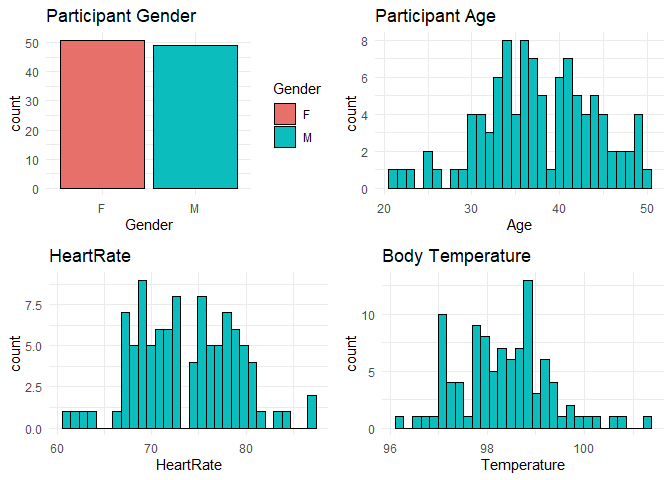
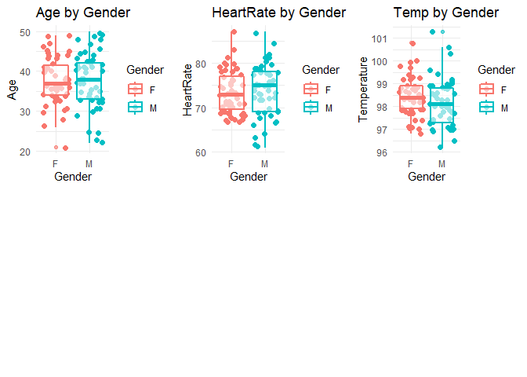
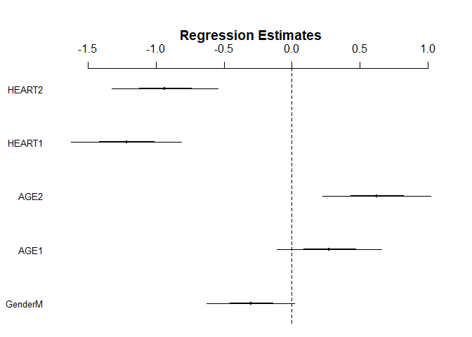
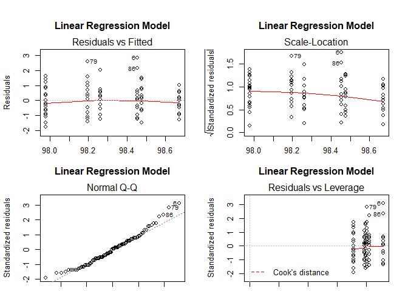

Analyses with Data from Biostatistics With R
================
Paul G. Smith
First created on Nov 1, 2019. Updated on Dec 02, 2019

## Analyses with Data from Biostatistics With R by Babak Shahbaba

### Analysis of BodyTemperature Data Set

``` r
source("Dependencies.R", echo = TRUE)
```

    ## 
    ## > library(scales)
    ## 
    ## > library(Hmisc)

    ## Loading required package: lattice

    ## Loading required package: survival

    ## Loading required package: Formula

    ## Loading required package: ggplot2

    ## 
    ## Attaching package: 'Hmisc'

    ## The following objects are masked from 'package:base':
    ## 
    ##     format.pval, units

    ## 
    ## > library(e1071)

    ## 
    ## Attaching package: 'e1071'

    ## The following object is masked from 'package:Hmisc':
    ## 
    ##     impute

    ## 
    ## > library(psych)

    ## 
    ## Attaching package: 'psych'

    ## The following object is masked from 'package:Hmisc':
    ## 
    ##     describe

    ## The following objects are masked from 'package:ggplot2':
    ## 
    ##     %+%, alpha

    ## The following objects are masked from 'package:scales':
    ## 
    ##     alpha, rescale

    ## 
    ## > library(tidyverse)

    ## -- Attaching packages --------------------------- tidyverse 1.2.1 --

    ## v tibble  2.1.3     v purrr   0.3.3
    ## v tidyr   1.0.0     v dplyr   0.8.3
    ## v readr   1.3.1     v stringr 1.4.0
    ## v tibble  2.1.3     v forcats 0.4.0

    ## -- Conflicts ------------------------------ tidyverse_conflicts() --
    ## x psych::%+%()        masks ggplot2::%+%()
    ## x psych::alpha()      masks ggplot2::alpha(), scales::alpha()
    ## x readr::col_factor() masks scales::col_factor()
    ## x purrr::discard()    masks scales::discard()
    ## x dplyr::filter()     masks stats::filter()
    ## x dplyr::lag()        masks stats::lag()
    ## x dplyr::src()        masks Hmisc::src()
    ## x dplyr::summarize()  masks Hmisc::summarize()

    ## 
    ## > library(gridExtra)

    ## 
    ## Attaching package: 'gridExtra'

    ## The following object is masked from 'package:dplyr':
    ## 
    ##     combine

    ## 
    ## > library(arm)

    ## Loading required package: MASS

    ## 
    ## Attaching package: 'MASS'

    ## The following object is masked from 'package:dplyr':
    ## 
    ##     select

    ## Loading required package: Matrix

    ## 
    ## Attaching package: 'Matrix'

    ## The following objects are masked from 'package:tidyr':
    ## 
    ##     expand, pack, unpack

    ## Loading required package: lme4

    ## 
    ## arm (Version 1.10-1, built: 2018-4-12)

    ## Working directory is D:/RProjects/github/biostatistics

    ## 
    ## Attaching package: 'arm'

    ## The following objects are masked from 'package:psych':
    ## 
    ##     logit, rescale, sim

    ## The following object is masked from 'package:scales':
    ## 
    ##     rescale

    ## 
    ## > library(gvlma)

``` r
source("001_Load data and create variables.R", echo = TRUE)
```

    ## 
    ## > BodyTemperature <- read.csv("./data/BodyTemperature.txt", 
    ## +     header = TRUE, sep = " ")
    ## 
    ## > summary(BodyTemperature$Age)
    ##    Min. 1st Qu.  Median    Mean 3rd Qu.    Max. 
    ##   21.00   33.75   37.00   37.62   42.00   50.00 
    ## 
    ## > pretty_breaks(2)(BodyTemperature$Age)
    ## [1] 20 40 60
    ## 
    ## > a <- ggplot(BodyTemperature, aes(Age))
    ## 
    ## > a + geom_histogram(aes(color = Age), color = "black", 
    ## +     fill = "#0CBDBD") + geom_vline(xintercept = 35) + geom_vline(xintercept = 40)

    ## `stat_bin()` using `bins = 30`. Pick better value with `binwidth`.

<!-- -->

    ## 
    ## > BodyTemperature$AGEGRP <- 9
    ## 
    ## > BodyTemperature$AGEGRP[BodyTemperature$Age < 35] <- 1
    ## 
    ## > BodyTemperature$AGEGRP[BodyTemperature$Age > 34 & 
    ## +     BodyTemperature$Age < 41] <- 2
    ## 
    ## > BodyTemperature$AGEGRP[BodyTemperature$Age > 40] <- 3
    ## 
    ## > table(BodyTemperature$AGEGRP)
    ## 
    ##  1  2  3 
    ## 33 31 36 
    ## 
    ## > BodyTemperature$AGEGRP <- as.factor(BodyTemperature$AGEGRP)
    ## 
    ## > BodyTemperature$AGE1 <- 0
    ## 
    ## > BodyTemperature$AGE2 <- 0
    ## 
    ## > BodyTemperature$AGE3 <- 0
    ## 
    ## > BodyTemperature$AGE1[BodyTemperature$Age < 35] <- 1
    ## 
    ## > BodyTemperature$AGE2[BodyTemperature$Age > 34 & BodyTemperature$Age < 
    ## +     41] <- 1
    ## 
    ## > BodyTemperature$AGE3[BodyTemperature$Age > 40] <- 1
    ## 
    ## > table(BodyTemperature$AGEGRP, BodyTemperature$AGE1)
    ##    
    ##      0  1
    ##   1  0 33
    ##   2 31  0
    ##   3 36  0
    ## 
    ## > table(BodyTemperature$AGEGRP, BodyTemperature$AGE2)
    ##    
    ##      0  1
    ##   1 33  0
    ##   2  0 31
    ##   3 36  0
    ## 
    ## > table(BodyTemperature$AGEGRP, BodyTemperature$AGE3)
    ##    
    ##      0  1
    ##   1 33  0
    ##   2 31  0
    ##   3  0 36
    ## 
    ## > pretty_breaks(2)(BodyTemperature$HeartRate)
    ## [1] 60 70 80 90
    ## 
    ## > b <- ggplot(BodyTemperature, aes(HeartRate))
    ## 
    ## > b + geom_histogram(aes(color = HeartRate), color = "black", 
    ## +     fill = "#0CBDBD") + geom_vline(xintercept = 70) + geom_vline(xintercept = 76)

    ## `stat_bin()` using `bins = 30`. Pick better value with `binwidth`.

<!-- -->

    ## 
    ## > BodyTemperature$HEARTRATEGRP <- 9
    ## 
    ## > BodyTemperature$HEARTRATEGRP[BodyTemperature$HeartRate < 
    ## +     71] <- 1
    ## 
    ## > BodyTemperature$HEARTRATEGRP[BodyTemperature$HeartRate > 
    ## +     70 & BodyTemperature$HeartRate < 77] <- 2
    ## 
    ## > BodyTemperature$HEARTRATEGRP[BodyTemperature$HeartRate > 
    ## +     76] <- 3
    ## 
    ## > table(BodyTemperature$HEARTRATEGRP)
    ## 
    ##  1  2  3 
    ## 31 37 32 
    ## 
    ## > BodyTemperature$HEARTRATEGRP <- as.factor(BodyTemperature$HEARTRATEGRP)
    ## 
    ## > BodyTemperature$HEART1 <- 0
    ## 
    ## > BodyTemperature$HEART2 <- 0
    ## 
    ## > BodyTemperature$HEART3 <- 0
    ## 
    ## > BodyTemperature$HEART1[BodyTemperature$HEARTRATEGRP == 
    ## +     1] <- 1
    ## 
    ## > BodyTemperature$HEART2[BodyTemperature$HEARTRATEGRP == 
    ## +     2] <- 1
    ## 
    ## > BodyTemperature$HEART3[BodyTemperature$HEARTRATEGRP == 
    ## +     3] <- 1
    ## 
    ## > table(BodyTemperature$HEARTRATEGRP, BodyTemperature$HEART1)
    ##    
    ##      0  1
    ##   1  0 31
    ##   2 37  0
    ##   3 32  0
    ## 
    ## > table(BodyTemperature$HEARTRATEGRP, BodyTemperature$HEART2)
    ##    
    ##      0  1
    ##   1 31  0
    ##   2  0 37
    ##   3 32  0
    ## 
    ## > table(BodyTemperature$HEARTRATEGRP, BodyTemperature$HEART3)
    ##    
    ##      0  1
    ##   1 31  0
    ##   2 37  0
    ##   3  0 32
    ## 
    ## > str(BodyTemperature)
    ## 'data.frame':    100 obs. of  12 variables:
    ##  $ Gender      : Factor w/ 2 levels "F","M": 2 2 2 1 1 2 1 1 1 2 ...
    ##  $ Age         : int  33 32 42 33 26 37 32 45 31 49 ...
    ##  $ HeartRate   : int  69 72 68 75 68 79 71 73 77 81 ...
    ##  $ Temperature : num  97 98.8 96.2 97.8 98.8 ...
    ##  $ AGEGRP      : Factor w/ 3 levels "1","2","3": 1 1 3 1 1 2 1 3 1 3 ...
    ##  $ AGE1        : num  1 1 0 1 1 0 1 0 1 0 ...
    ##  $ AGE2        : num  0 0 0 0 0 1 0 0 0 0 ...
    ##  $ AGE3        : num  0 0 1 0 0 0 0 1 0 1 ...
    ##  $ HEARTRATEGRP: Factor w/ 3 levels "1","2","3": 1 2 1 2 1 3 2 2 3 3 ...
    ##  $ HEART1      : num  1 0 1 0 1 0 0 0 0 0 ...
    ##  $ HEART2      : num  0 1 0 1 0 0 1 1 0 0 ...
    ##  $ HEART3      : num  0 0 0 0 0 1 0 0 1 1 ...
    ## 
    ## > write.csv(BodyTemperature, file = "./data/bodytemperature_data.csv", 
    ## +     row.names = FALSE)

### Documentation and Data Dictionary

``` r
source("002_Create data dictionary.R", echo = TRUE)
```

    ## 
    ## > BodyTemperature <- read.csv(file = "./data/bodytemperature_data.csv", 
    ## +     header = TRUE, sep = ",")
    ## 
    ## > str(BodyTemperature)
    ## 'data.frame':    100 obs. of  12 variables:
    ##  $ Gender      : Factor w/ 2 levels "F","M": 2 2 2 1 1 2 1 1 1 2 ...
    ##  $ Age         : int  33 32 42 33 26 37 32 45 31 49 ...
    ##  $ HeartRate   : int  69 72 68 75 68 79 71 73 77 81 ...
    ##  $ Temperature : num  97 98.8 96.2 97.8 98.8 ...
    ##  $ AGEGRP      : int  1 1 3 1 1 2 1 3 1 3 ...
    ##  $ AGE1        : int  1 1 0 1 1 0 1 0 1 0 ...
    ##  $ AGE2        : int  0 0 0 0 0 1 0 0 0 0 ...
    ##  $ AGE3        : int  0 0 1 0 0 0 0 1 0 1 ...
    ##  $ HEARTRATEGRP: int  1 2 1 2 1 3 2 2 3 3 ...
    ##  $ HEART1      : int  1 0 1 0 1 0 0 0 0 0 ...
    ##  $ HEART2      : int  0 1 0 1 0 0 1 1 0 0 ...
    ##  $ HEART3      : int  0 0 0 0 0 1 0 0 1 1 ...
    ## 
    ## > summary(BodyTemperature)
    ##  Gender      Age          HeartRate      Temperature         AGEGRP    
    ##  F:51   Min.   :21.00   Min.   :61.00   Min.   : 96.20   Min.   :1.00  
    ##  M:49   1st Qu.:33.75   1st Qu.:69.00   1st Qu.: 97.70   1st Qu.:1.00  
    ##         Median :37.00   Median :73.00   Median : 98.30   Median :2.00  
    ##         Mean   :37.62   Mean   :73.66   Mean   : 98.33   Mean   :2.03  
    ##         3rd Qu.:42.00   3rd Qu.:78.00   3rd Qu.: 98.90   3rd Qu.:3.00  
    ##         Max.   :50.00   Max.   :87.00   Max.   :101.30   Max.   :3.00  
    ##       AGE1           AGE2           AGE3       HEARTRATEGRP      HEART1    
    ##  Min.   :0.00   Min.   :0.00   Min.   :0.00   Min.   :1.00   Min.   :0.00  
    ##  1st Qu.:0.00   1st Qu.:0.00   1st Qu.:0.00   1st Qu.:1.00   1st Qu.:0.00  
    ##  Median :0.00   Median :0.00   Median :0.00   Median :2.00   Median :0.00  
    ##  Mean   :0.33   Mean   :0.31   Mean   :0.36   Mean   :2.01   Mean   :0.31  
    ##  3rd Qu.:1.00   3rd Qu.:1.00   3rd Qu.:1.00   3rd Qu.:3.00   3rd Qu.:1.00  
    ##  Max.   :1.00   Max.   :1.00   Max.   :1.00   Max.   :3.00   Max.   :1.00  
    ##      HEART2         HEART3    
    ##  Min.   :0.00   Min.   :0.00  
    ##  1st Qu.:0.00   1st Qu.:0.00  
    ##  Median :0.00   Median :0.00  
    ##  Mean   :0.37   Mean   :0.32  
    ##  3rd Qu.:1.00   3rd Qu.:1.00  
    ##  Max.   :1.00   Max.   :1.00  
    ## 
    ## > sapply(BodyTemperature[2:4], function(x) c(`Stand dev` = sd(x), 
    ## +     Mean = mean(x, na.rm = TRUE), n = length(x), Median = median(x), 
    ## +     Coeff .... [TRUNCATED] 
    ##                             Age    HeartRate  Temperature
    ## Stand dev             6.4303259   5.31287744 9.568995e-01
    ## Mean                 37.6200000  73.66000000 9.833000e+01
    ## n                   100.0000000 100.00000000 1.000000e+02
    ## Median               37.0000000  73.00000000 9.830000e+01
    ## CoeffofVariation      0.1709284   0.07212704 9.731511e-03
    ## Minimum              21.0000000  61.00000000 9.620000e+01
    ## Maximun              50.0000000  87.00000000 1.013000e+02
    ## Upper Quantile.100%  50.0000000  87.00000000 1.013000e+02
    ## LowerQuartile.0%     21.0000000  61.00000000 9.620000e+01
    ## 
    ## > data_dictionary <- Hmisc::describe((BodyTemperature))
    ## 
    ## > sink("./data/BodyTemperature_data_dictionary.txt", 
    ## +     append = TRUE)
    ## 
    ## > psych::describe(BodyTemperature)
    ##              vars   n  mean   sd median trimmed  mad  min   max range  skew
    ## Gender*         1 100  1.49 0.50    1.0    1.49 0.00  1.0   2.0   1.0  0.04
    ## Age             2 100 37.62 6.43   37.0   37.76 5.93 21.0  50.0  29.0 -0.23
    ## HeartRate       3 100 73.66 5.31   73.0   73.60 5.93 61.0  87.0  26.0  0.09
    ## Temperature     4 100 98.33 0.96   98.3   98.29 0.89 96.2 101.3   5.1  0.38
    ## AGEGRP          5 100  2.03 0.83    2.0    2.04 1.48  1.0   3.0   2.0 -0.06
    ## AGE1            6 100  0.33 0.47    0.0    0.29 0.00  0.0   1.0   1.0  0.71
    ## AGE2            7 100  0.31 0.46    0.0    0.26 0.00  0.0   1.0   1.0  0.81
    ## AGE3            8 100  0.36 0.48    0.0    0.32 0.00  0.0   1.0   1.0  0.57
    ## HEARTRATEGRP    9 100  2.01 0.80    2.0    2.01 1.48  1.0   3.0   2.0 -0.02
    ## HEART1         10 100  0.31 0.46    0.0    0.26 0.00  0.0   1.0   1.0  0.81
    ## HEART2         11 100  0.37 0.49    0.0    0.34 0.00  0.0   1.0   1.0  0.53
    ## HEART3         12 100  0.32 0.47    0.0    0.28 0.00  0.0   1.0   1.0  0.76
    ##              kurtosis   se
    ## Gender*         -2.02 0.05
    ## Age             -0.32 0.64
    ## HeartRate       -0.38 0.53
    ## Temperature      0.22 0.10
    ## AGEGRP          -1.58 0.08
    ## AGE1            -1.51 0.05
    ## AGE2            -1.36 0.05
    ## AGE3            -1.69 0.05
    ## HEARTRATEGRP    -1.44 0.08
    ## HEART1          -1.36 0.05
    ## HEART2          -1.74 0.05
    ## HEART3          -1.44 0.05

### Plot variables

``` r
source("100_Plot individual variables.R", echo = TRUE)
```

    ## 
    ## > BodyTemperature <- read.csv(file = "./data/bodytemperature_data.csv", 
    ## +     header = TRUE, sep = ",")
    ## 
    ## > p1 <- ggplot(BodyTemperature, aes(Gender, fill = Gender))
    ## 
    ## > p1 <- p1 + geom_bar(aes(Gender), color = "black") + 
    ## +     scale_fill_manual(values = c("#E8706A", "#0CBDBD")) + theme_minimal() + 
    ## +     labs(title .... [TRUNCATED] 
    ## 
    ## > p2 <- ggplot(BodyTemperature, aes(Age))
    ## 
    ## > p2 <- p2 + geom_histogram(aes(color = Age), color = "black", 
    ## +     fill = "#0CBDBD") + theme_minimal() + labs(title = "Participant Age")
    ## 
    ## > p3 <- ggplot(BodyTemperature, aes(HeartRate))
    ## 
    ## > p3 <- p3 + geom_histogram(aes(color = HeartRate), 
    ## +     color = "black", fill = "#0CBDBD") + theme_minimal() + labs(title = "HeartRate")
    ## 
    ## > p4 <- ggplot(BodyTemperature, aes(Temperature))
    ## 
    ## > p4 <- p4 + geom_histogram(aes(color = Temperature), 
    ## +     color = "black", fill = "#0CBDBD") + theme_minimal() + labs(title = "Body Temperature")
    ## 
    ## > grid.arrange(p1, p2, p3, p4, nrow = 2, ncol = 2)

    ## `stat_bin()` using `bins = 30`. Pick better value with `binwidth`.
    ## `stat_bin()` using `bins = 30`. Pick better value with `binwidth`.
    ## `stat_bin()` using `bins = 30`. Pick better value with `binwidth`.

<!-- -->

``` r
source("105_Variable boxplots.R", echo = TRUE)
```

    ## 
    ## > BodyTemperature <- read.csv(file = "./data/bodytemperature_data.csv", 
    ## +     header = TRUE, sep = ",")
    ## 
    ## > p5 <- ggplot(BodyTemperature, aes(x = Gender, y = Age))
    ## 
    ## > p5 <- p5 + geom_jitter(aes(color = Gender), size = 2) + 
    ## +     geom_boxplot(aes(color = Gender), alpha = 0.6, size = 1) + 
    ## +     theme_minimal() + l .... [TRUNCATED] 
    ## 
    ## > p6 <- ggplot(BodyTemperature, aes(x = Gender, y = HeartRate))
    ## 
    ## > p6 <- p6 + geom_jitter(aes(color = Gender), size = 2) + 
    ## +     geom_boxplot(aes(color = Gender), alpha = 0.6, size = 1) + 
    ## +     theme_minimal() + l .... [TRUNCATED] 
    ## 
    ## > p7 <- ggplot(BodyTemperature, aes(x = Gender, y = Temperature))
    ## 
    ## > p7 <- p7 + geom_jitter(aes(color = Gender), size = 2) + 
    ## +     geom_boxplot(aes(color = Gender), alpha = 0.6, size = 1) + 
    ## +     theme_minimal() + l .... [TRUNCATED] 
    ## 
    ## > grid.arrange(p5, p6, p7, nrow = 2, ncol = 3)

<!-- -->

``` r
source("110_Two variable plots.R", echo = TRUE)
```

    ## 
    ## > BodyTemperature <- read.csv(file = "./data/bodytemperature_data.csv", 
    ## +     header = TRUE, sep = ",")
    ## 
    ## > p8 <- ggplot(BodyTemperature, aes(x = Age, y = HeartRate, 
    ## +     color = Gender))
    ## 
    ## > p8 <- p8 + geom_point(size = 2) + geom_smooth()
    ## 
    ## > p9 <- ggplot(BodyTemperature, aes(x = Age, y = Temperature, 
    ## +     color = Gender))
    ## 
    ## > p9 <- p9 + geom_point(size = 2) + geom_smooth()
    ## 
    ## > p10 <- ggplot(BodyTemperature, aes(x = HeartRate, 
    ## +     y = Temperature, color = Gender))
    ## 
    ## > p10 <- p10 + geom_point(size = 2) + geom_smooth()
    ## 
    ## > grid.arrange(p8, p9, p10, nrow = 2, ncol = 2)

    ## `geom_smooth()` using method = 'loess' and formula 'y ~ x'

    ## `geom_smooth()` using method = 'loess' and formula 'y ~ x'
    ## `geom_smooth()` using method = 'loess' and formula 'y ~ x'

<!-- -->

``` r
source("115_Plot created variables 1.R", echo = TRUE)
```

    ## 
    ## > BodyTemperature <- read.csv(file = "./data/bodytemperature_data.csv", 
    ## +     header = TRUE, sep = ",")
    ## 
    ## > p11 <- ggplot(BodyTemperature, aes(AGEGRP))
    ## 
    ## > p11 <- p11 + geom_bar(color = "black", fill = "#0CBDBD") + 
    ## +     theme_minimal() + labs(title = "Bar Chart of Age Groups")
    ## 
    ## > p12 <- ggplot(BodyTemperature, aes(HEARTRATEGRP))
    ## 
    ## > p12 <- p12 + geom_bar(color = "black", fill = "#0CBDBD") + 
    ## +     theme_minimal() + labs(title = "Bar Chart of Heart Rate Groups")
    ## 
    ## > grid.arrange(p11, p12, nrow = 2, ncol = 2)

<!-- -->

### Regression Model 1

``` r
source("200_Regression model 1.R", echo = TRUE)
```

    ## 
    ## > BodyTemperature <- read.csv(file = "./data/bodytemperature_data.csv", 
    ## +     header = TRUE, sep = ",")
    ## 
    ## > model1 <- lm(Temperature ~ Gender + Age + HeartRate, 
    ## +     data = BodyTemperature)
    ## 
    ## > summary(model1)
    ## 
    ## Call:
    ## lm(formula = Temperature ~ Gender + Age + HeartRate, data = BodyTemperature)
    ## 
    ## Residuals:
    ##     Min      1Q  Median      3Q     Max 
    ## -2.2141 -0.4109 -0.0484  0.5248  2.6473 
    ## 
    ## Coefficients:
    ##             Estimate Std. Error t value Pr(>|t|)    
    ## (Intercept) 93.18172    1.22901  75.819  < 2e-16 ***
    ## GenderM     -0.29198    0.16790  -1.739   0.0852 .  
    ## Age         -0.02630    0.01318  -1.996   0.0487 *  
    ## HeartRate    0.08527    0.01596   5.344 6.13e-07 ***
    ## ---
    ## Signif. codes:  0 '***' 0.001 '**' 0.01 '*' 0.05 '.' 0.1 ' ' 1
    ## 
    ## Residual standard error: 0.8381 on 96 degrees of freedom
    ## Multiple R-squared:  0.2561, Adjusted R-squared:  0.2329 
    ## F-statistic: 11.02 on 3 and 96 DF,  p-value: 2.786e-06
    ## 
    ## 
    ## > coefplot(model1)

<!-- -->

    ## 
    ## > layout(matrix(c(1, 2, 3, 4), 2, 2))
    ## 
    ## > plot(model1, main = "Linear Regression Model")

<!-- -->

    ## 
    ## > gvmodel <- gvlma(model1)
    ## 
    ## > summary(model1)
    ## 
    ## Call:
    ## lm(formula = Temperature ~ Gender + Age + HeartRate, data = BodyTemperature)
    ## 
    ## Residuals:
    ##     Min      1Q  Median      3Q     Max 
    ## -2.2141 -0.4109 -0.0484  0.5248  2.6473 
    ## 
    ## Coefficients:
    ##             Estimate Std. Error t value Pr(>|t|)    
    ## (Intercept) 93.18172    1.22901  75.819  < 2e-16 ***
    ## GenderM     -0.29198    0.16790  -1.739   0.0852 .  
    ## Age         -0.02630    0.01318  -1.996   0.0487 *  
    ## HeartRate    0.08527    0.01596   5.344 6.13e-07 ***
    ## ---
    ## Signif. codes:  0 '***' 0.001 '**' 0.01 '*' 0.05 '.' 0.1 ' ' 1
    ## 
    ## Residual standard error: 0.8381 on 96 degrees of freedom
    ## Multiple R-squared:  0.2561, Adjusted R-squared:  0.2329 
    ## F-statistic: 11.02 on 3 and 96 DF,  p-value: 2.786e-06
    ## 
    ## 
    ## > gvmodel
    ## 
    ## Call:
    ## lm(formula = Temperature ~ Gender + Age + HeartRate, data = BodyTemperature)
    ## 
    ## Coefficients:
    ## (Intercept)      GenderM          Age    HeartRate  
    ##    93.18172     -0.29198     -0.02630      0.08527  
    ## 
    ## 
    ## ASSESSMENT OF THE LINEAR MODEL ASSUMPTIONS
    ## USING THE GLOBAL TEST ON 4 DEGREES-OF-FREEDOM:
    ## Level of Significance =  0.05 
    ## 
    ## Call:
    ##  gvlma(x = model1) 
    ## 
    ##                      Value p-value                Decision
    ## Global Stat        2.52620  0.6400 Assumptions acceptable.
    ## Skewness           0.06985  0.7916 Assumptions acceptable.
    ## Kurtosis           2.37142  0.1236 Assumptions acceptable.
    ## Link Function      0.02931  0.8641 Assumptions acceptable.
    ## Heteroscedasticity 0.05562  0.8136 Assumptions acceptable.

### Step-wise Regressions

``` r
source("210_Additional regression models.R", echo = TRUE)
```

    ## 
    ## > BodyTemperature <- read.csv(file = "./data/bodytemperature_data.csv", 
    ## +     header = TRUE, sep = ",")
    ## 
    ## > model2 <- lm(Temperature ~ Gender + HeartRate, data = BodyTemperature)
    ## 
    ## > summary(model2)
    ## 
    ## Call:
    ## lm(formula = Temperature ~ Gender + HeartRate, data = BodyTemperature)
    ## 
    ## Residuals:
    ##      Min       1Q   Median       3Q      Max 
    ## -2.37056 -0.48862 -0.00963  0.53575  2.68538 
    ## 
    ## Coefficients:
    ##             Estimate Std. Error t value Pr(>|t|)    
    ## (Intercept) 92.43764    1.18902  77.743  < 2e-16 ***
    ## GenderM     -0.30044    0.17041  -1.763    0.081 .  
    ## HeartRate    0.08199    0.01612   5.088 1.77e-06 ***
    ## ---
    ## Signif. codes:  0 '***' 0.001 '**' 0.01 '*' 0.05 '.' 0.1 ' ' 1
    ## 
    ## Residual standard error: 0.8509 on 97 degrees of freedom
    ## Multiple R-squared:  0.2252, Adjusted R-squared:  0.2093 
    ## F-statistic:  14.1 on 2 and 97 DF,  p-value: 4.212e-06
    ## 
    ## 
    ## > model3 <- lm(Temperature ~ Gender + AGE1 + AGE2 + 
    ## +     AGE3, data = BodyTemperature)
    ## 
    ## > summary(model3)
    ## 
    ## Call:
    ## lm(formula = Temperature ~ Gender + AGE1 + AGE2 + AGE3, data = BodyTemperature)
    ## 
    ## Residuals:
    ##      Min       1Q   Median       3Q      Max 
    ## -1.77934 -0.60378  0.02488  0.54433  2.84433 
    ## 
    ## Coefficients: (1 not defined because of singularities)
    ##             Estimate Std. Error t value Pr(>|t|)    
    ## (Intercept)  98.1946     0.1890 519.452   <2e-16 ***
    ## GenderM      -0.2152     0.1896  -1.135    0.259    
    ## AGE1          0.2825     0.2274   1.242    0.217    
    ## AGE2          0.4763     0.2322   2.051    0.043 *  
    ## AGE3              NA         NA      NA       NA    
    ## ---
    ## Signif. codes:  0 '***' 0.001 '**' 0.01 '*' 0.05 '.' 0.1 ' ' 1
    ## 
    ## Residual standard error: 0.9418 on 96 degrees of freedom
    ## Multiple R-squared:  0.06058,    Adjusted R-squared:  0.03123 
    ## F-statistic: 2.064 on 3 and 96 DF,  p-value: 0.1101
    ## 
    ## 
    ## > model4 <- lm(Temperature ~ Gender + AGE1 + AGE2, data = BodyTemperature)
    ## 
    ## > summary(model4)
    ## 
    ## Call:
    ## lm(formula = Temperature ~ Gender + AGE1 + AGE2, data = BodyTemperature)
    ## 
    ## Residuals:
    ##      Min       1Q   Median       3Q      Max 
    ## -1.77934 -0.60378  0.02488  0.54433  2.84433 
    ## 
    ## Coefficients:
    ##             Estimate Std. Error t value Pr(>|t|)    
    ## (Intercept)  98.1946     0.1890 519.452   <2e-16 ***
    ## GenderM      -0.2152     0.1896  -1.135    0.259    
    ## AGE1          0.2825     0.2274   1.242    0.217    
    ## AGE2          0.4763     0.2322   2.051    0.043 *  
    ## ---
    ## Signif. codes:  0 '***' 0.001 '**' 0.01 '*' 0.05 '.' 0.1 ' ' 1
    ## 
    ## Residual standard error: 0.9418 on 96 degrees of freedom
    ## Multiple R-squared:  0.06058,    Adjusted R-squared:  0.03123 
    ## F-statistic: 2.064 on 3 and 96 DF,  p-value: 0.1101
    ## 
    ## 
    ## > model5 <- lm(Temperature ~ Gender + HEART1 + HEART2 + 
    ## +     HEART3, data = BodyTemperature)
    ## 
    ## > summary(model5)
    ## 
    ## Call:
    ## lm(formula = Temperature ~ Gender + HEART1 + HEART2 + HEART3, 
    ##     data = BodyTemperature)
    ## 
    ## Residuals:
    ##      Min       1Q   Median       3Q      Max 
    ## -2.18635 -0.50638  0.01182  0.57598  2.46716 
    ## 
    ## Coefficients: (1 not defined because of singularities)
    ##             Estimate Std. Error t value Pr(>|t|)    
    ## (Intercept)  99.1864     0.1742 569.389  < 2e-16 ***
    ## GenderM      -0.3535     0.1669  -2.118   0.0367 *  
    ## HEART1       -1.1428     0.2100  -5.442 4.03e-07 ***
    ## HEART2       -0.8888     0.2011  -4.419 2.61e-05 ***
    ## HEART3            NA         NA      NA       NA    
    ## ---
    ## Signif. codes:  0 '***' 0.001 '**' 0.01 '*' 0.05 '.' 0.1 ' ' 1
    ## 
    ## Residual standard error: 0.8301 on 96 degrees of freedom
    ## Multiple R-squared:  0.2703, Adjusted R-squared:  0.2475 
    ## F-statistic: 11.85 on 3 and 96 DF,  p-value: 1.136e-06
    ## 
    ## 
    ## > model6 <- lm(Temperature ~ Gender + AGE1 + AGE2 + 
    ## +     HEART1 + HEART2, data = BodyTemperature)
    ## 
    ## > summary(model6)
    ## 
    ## Call:
    ## lm(formula = Temperature ~ Gender + AGE1 + AGE2 + HEART1 + HEART2, 
    ##     data = BodyTemperature)
    ## 
    ## Residuals:
    ##      Min       1Q   Median       3Q      Max 
    ## -2.19215 -0.52057 -0.03705  0.48214  2.06131 
    ## 
    ## Coefficients:
    ##             Estimate Std. Error t value Pr(>|t|)    
    ## (Intercept)  98.9196     0.1993 496.219  < 2e-16 ***
    ## GenderM      -0.3029     0.1613  -1.878  0.06348 .  
    ## AGE1          0.2725     0.1927   1.414  0.16056    
    ## AGE2          0.6219     0.1982   3.138  0.00227 ** 
    ## HEART1       -1.2188     0.2038  -5.979 4.02e-08 ***
    ## HEART2       -0.9354     0.1941  -4.819 5.54e-06 ***
    ## ---
    ## Signif. codes:  0 '***' 0.001 '**' 0.01 '*' 0.05 '.' 0.1 ' ' 1
    ## 
    ## Residual standard error: 0.7981 on 94 degrees of freedom
    ## Multiple R-squared:  0.3395, Adjusted R-squared:  0.3044 
    ## F-statistic: 9.664 on 5 and 94 DF,  p-value: 1.809e-07
    ## 
    ## 
    ## > model7 <- lm(Temperature ~ AGE1 + AGE2 + HEART1 + 
    ## +     HEART2, data = BodyTemperature)
    ## 
    ## > summary(model7)
    ## 
    ## Call:
    ## lm(formula = Temperature ~ AGE1 + AGE2 + HEART1 + HEART2, data = BodyTemperature)
    ## 
    ## Residuals:
    ##      Min       1Q   Median       3Q      Max 
    ## -2.02704 -0.44331 -0.05913  0.47404  2.06697 
    ## 
    ## Coefficients:
    ##             Estimate Std. Error t value Pr(>|t|)    
    ## (Intercept)  98.7330     0.1751 563.854  < 2e-16 ***
    ## AGE1          0.2940     0.1949   1.509  0.13471    
    ## AGE2          0.6593     0.1998   3.300  0.00136 ** 
    ## HEART1       -1.1897     0.2059  -5.777 9.59e-08 ***
    ## HEART2       -0.9071     0.1961  -4.626 1.18e-05 ***
    ## ---
    ## Signif. codes:  0 '***' 0.001 '**' 0.01 '*' 0.05 '.' 0.1 ' ' 1
    ## 
    ## Residual standard error: 0.8086 on 95 degrees of freedom
    ## Multiple R-squared:  0.3147, Adjusted R-squared:  0.2859 
    ## F-statistic: 10.91 on 4 and 95 DF,  p-value: 2.547e-07
    ## 
    ## 
    ## > summary(model1)$adj.r.squared
    ## [1] 0.2328827
    ## 
    ## > summary(model2)$adj.r.squared
    ## [1] 0.2092705
    ## 
    ## > summary(model3)$adj.r.squared
    ## [1] 0.03122806
    ## 
    ## > summary(model4)$adj.r.squared
    ## [1] 0.03122806
    ## 
    ## > summary(model5)$adj.r.squared
    ## [1] 0.2474747
    ## 
    ## > summary(model6)$adj.r.squared
    ## [1] 0.3043869
    ## 
    ## > summary(model7)$adj.r.squared
    ## [1] 0.2858838
    ## 
    ## > coefplot(model6)

<!-- -->

    ## 
    ## > layout(matrix(c(1, 2, 3, 4), 2, 2))
    ## 
    ## > plot(model4, main = "Linear Regression Model")

<!-- -->

    ## 
    ## > gvmodel <- gvlma(model6)
    ## 
    ## > summary(model6)
    ## 
    ## Call:
    ## lm(formula = Temperature ~ Gender + AGE1 + AGE2 + HEART1 + HEART2, 
    ##     data = BodyTemperature)
    ## 
    ## Residuals:
    ##      Min       1Q   Median       3Q      Max 
    ## -2.19215 -0.52057 -0.03705  0.48214  2.06131 
    ## 
    ## Coefficients:
    ##             Estimate Std. Error t value Pr(>|t|)    
    ## (Intercept)  98.9196     0.1993 496.219  < 2e-16 ***
    ## GenderM      -0.3029     0.1613  -1.878  0.06348 .  
    ## AGE1          0.2725     0.1927   1.414  0.16056    
    ## AGE2          0.6219     0.1982   3.138  0.00227 ** 
    ## HEART1       -1.2188     0.2038  -5.979 4.02e-08 ***
    ## HEART2       -0.9354     0.1941  -4.819 5.54e-06 ***
    ## ---
    ## Signif. codes:  0 '***' 0.001 '**' 0.01 '*' 0.05 '.' 0.1 ' ' 1
    ## 
    ## Residual standard error: 0.7981 on 94 degrees of freedom
    ## Multiple R-squared:  0.3395, Adjusted R-squared:  0.3044 
    ## F-statistic: 9.664 on 5 and 94 DF,  p-value: 1.809e-07
    ## 
    ## 
    ## > gvmodel
    ## 
    ## Call:
    ## lm(formula = Temperature ~ Gender + AGE1 + AGE2 + HEART1 + HEART2, 
    ##     data = BodyTemperature)
    ## 
    ## Coefficients:
    ## (Intercept)      GenderM         AGE1         AGE2       HEART1       HEART2  
    ##     98.9196      -0.3029       0.2725       0.6219      -1.2188      -0.9354  
    ## 
    ## 
    ## ASSESSMENT OF THE LINEAR MODEL ASSUMPTIONS
    ## USING THE GLOBAL TEST ON 4 DEGREES-OF-FREEDOM:
    ## Level of Significance =  0.05 
    ## 
    ## Call:
    ##  gvlma(x = model6) 
    ## 
    ##                      Value p-value                Decision
    ## Global Stat        1.11111  0.8925 Assumptions acceptable.
    ## Skewness           0.35181  0.5531 Assumptions acceptable.
    ## Kurtosis           0.02101  0.8847 Assumptions acceptable.
    ## Link Function      0.12460  0.7241 Assumptions acceptable.
    ## Heteroscedasticity 0.61368  0.4334 Assumptions acceptable.
